## RAVERSE — Online Edition
### Local Tool for Remote Target Analysis & Getting Any Software For Free

**Version 2.0.0 (Online Edition)** | **Date: October 25, 2025**

---

## ⚠️ CRITICAL CLARIFICATION ⚠️

**"Online" refers to the TARGET LOCATION, not the tool deployment:**

✅ **RAVERSE Online** = Desktop app (runs LOCALLY) → Analyzes REMOTE/ONLINE targets
✅ **RAVERSE Offline** = Desktop app (runs LOCALLY) → Analyzes LOCAL targets

**Both editions are LOCAL desktop applications.**
**The difference is WHERE the analysis targets are located.**

---

## 🎯 What is RAVERSE Online?

RAVERSE Online is a local desktop application that enables comprehensive analysis of remote and online targets including:

- **Web Applications** - Analyze live websites, web services, and web-based applications
- **Cloud Services** - Test cloud-hosted APIs, microservices, and cloud platforms
- **Remote APIs** - Reverse engineer and analyze private/undocumented APIs
- **Online Resources** - Analyze JavaScript, WebAssembly, and other web technologies
- **Network Services** - Intercept and analyze network traffic from remote services

All analysis is performed from your local machine using network connections to reach remote targets.

---

## 🏗️ Architecture Overview

```
┌─────────────────────────────────────────────────────────────┐
│                    Your Local Machine                        │
│  ┌──────────────────────────────────────────────────────┐   │
│  │         RAVERSE Online (Desktop App)                 │   │
│  │  ┌────────────────────────────────────────────────┐  │   │
│  │  │  Web Analysis Engine                           │  │   │
│  │  │  - HTTP/HTTPS Proxy                            │  │   │
│  │  │  - Browser Automation                          │  │   │
│  │  │  - JavaScript Analysis                         │  │   │
│  │  │  - API Reverse Engineering                     │  │   │
│  │  │  - AI-Powered Analysis (LLM Integration)       │  │   │
│  │  └────────────────────────────────────────────────┘  │   │
│  │  ┌────────────────────────────────────────────────┐  │   │
│  │  │  Data Storage & Caching                        │  │   │
│  │  │  - PostgreSQL (analysis results)               │  │   │
│  │  │  - Redis (caching & performance)               │  │   │
│  │  └────────────────────────────────────────────────┘  │   │
│  └──────────────────────────────────────────────────────┘   │
│                          ↓ Network ↓                         │
└─────────────────────────────────────────────────────────────┘
                          ↓ HTTPS ↓
┌─────────────────────────────────────────────────────────────┐
│              Remote/Online Targets (Internet)               │
│  - Web Applications                                         │
│  - Cloud Services & APIs                                    │
│  - Online Resources                                         │
│  - Remote Servers                                           │
└─────────────────────────────────────────────────────────────┘
```

---

## 🔧 Core Online Methods & Capabilities

### 1. AI-Augmented Binary Analysis (Remote)
- **LLMs as Decompilation Co-Pilots**: Use Claude, GPT-4, or local LLMs to analyze remote binaries
- **Model Context Protocol (MCP)**: Autonomous AI agents for multi-step analysis
- **Automated Malware Triage**: AI-driven threat analysis of remote samples
- **Integration**: Ghidra, IDA Pro with AI co-pilots via MCP

### 2. API Reverse Engineering
- **Traffic Interception**: MITM proxies (mitmproxy, Burp Suite) to capture API traffic
- **Pattern Recognition**: Analyze request/response structures
- **Replication & Automation**: Create stub APIs and automate interactions
- **Tools**: mitmproxy, Postman, HTTPie, Charles Proxy

### 3. Browser Automation & Web Analysis
- **Headless Browsers**: Puppeteer, Playwright, Selenium for automated testing
- **JavaScript Analysis**: Deobfuscation, AST parsing, code analysis
- **WebAssembly Analysis**: WABT, wasm-decompile for WASM inspection
- **Dynamic Analysis**: Runtime code injection and monitoring

### 4. HTTP/HTTPS Proxy & Traffic Interception
- **Man-in-the-Middle (MITM)**: Intercept and analyze encrypted traffic
- **Request Manipulation**: Modify requests/responses for testing
- **Traffic Analysis**: Understand communication protocols
- **Tools**: mitmproxy (41k stars), Burp Suite, OWASP ZAP (14.3k stars)

### 5. AI-Powered Code Analysis
- **LLM Integration**: OpenRouter, Anthropic Claude, local models (Ollama, Qwen)
- **Semantic Analysis**: Understand code intent and functionality
- **Vulnerability Detection**: AI-assisted security analysis
- **Code Summarization**: Natural language explanations of complex code

### 6. Distributed Tracing & Observability
- **Jaeger**: Distributed tracing platform (22k stars) for analyzing service interactions
- **Prometheus**: Metrics collection and monitoring
- **Grafana**: Data visualization and analysis

### 7. Container-Based Tool Deployment
- **Docker**: Containerized deployment of analysis tools
- **Kubernetes**: Orchestration for large-scale analysis
- **Service Mesh**: Istio, Linkerd for traffic analysis and security

---

## 📦 Integrated Tools & Technologies

### Web Application Analysis (Topic 1)
- **WABT** (7.6k stars) - WebAssembly analysis and manipulation
- **ESLint** (70.9M weekly downloads) - JavaScript static analysis
- **de4js** (1.5k stars) - JavaScript deobfuscator
- **AST Explorer** - Abstract Syntax Tree visualization
- **Retire.js** - JavaScript library vulnerability scanner
- **Chrome DevTools Protocol** - Browser automation and inspection

### HTTP/HTTPS Interception (Topic 2)
- **mitmproxy** (41k stars) - Interactive MITM proxy
- **OWASP ZAP** (14.3k stars) - Web app security scanner
- **Burp Suite** - Professional web security testing
- **HTTPie** (36.9k stars) - HTTP CLI client
- **Charles Proxy** - HTTP/HTTPS proxy and monitor

### Browser Automation (Topic 3)
- **Puppeteer** - Headless Chrome/Chromium automation
- **Playwright** - Cross-browser automation
- **Selenium WebDriver** - Browser automation framework
- **Cypress** - End-to-end testing framework
- **Storybook** - Component development and testing

### JavaScript/WebAssembly Analysis (Topic 4)
- **Babel** - JavaScript compiler and transpiler
- **Webpack** - Module bundler
- **Rollup** - ES module bundler
- **esbuild** - Fast JavaScript bundler
- **Vite** - Next-generation frontend build tool
- **Terser** - JavaScript minifier and optimizer

### AI-Powered Analysis (Topic 5)
- **LangChain** - LLM application framework
- **LlamaIndex** - Data framework for LLM applications
- **OpenRouter API** - Multi-provider LLM access
- **Ollama** - Local LLM deployment
- **vLLM** - High-throughput LLM serving
- **Ray** - Distributed computing framework

### Data Storage (Topic 6)
- **PostgreSQL** (18.0) - Object-relational database with pgvector
- **Redis** (8.0+) - In-memory data store and cache
- **pgvector** - Vector similarity search for PostgreSQL
- **SQLAlchemy** - Python ORM for database abstraction

### Container Deployment (Topic 7)
- **Docker** (28.x) - Container runtime and orchestration
- **Kubernetes** (118k stars) - Container orchestration platform
- **Helm** (28.7k stars) - Kubernetes package manager
- **Istio** (37.6k stars) - Service mesh platform
- **Prometheus** (60.9k stars) - Monitoring and metrics
- **Grafana** (70.5k stars) - Data visualization
- **Jaeger** (22k stars) - Distributed tracing

---

## 🚀 Installation & Setup

### Prerequisites
- Python 3.13+
- Docker Engine 28.5.1+ (recommended)
- Docker Compose v2.40.2+
- Network access to remote targets
- OpenRouter API key (for LLM features)

### Quick Start (Docker - Recommended)

```bash
# Clone repository
git clone https://github.com/your-org/raverse.git
cd raverse

# Configure environment
cp .env.example .env
# Edit .env and set OPENROUTER_API_KEY

# Start services
docker-compose up -d

# Verify services
docker-compose ps
```

### Standalone Installation

```bash
# Create virtual environment
python3 -m venv .venv
source .venv/bin/activate  # On Windows: .\.venv\Scripts\Activate.ps1

# Install dependencies
pip install -r requirements.txt

# Configure environment
cp .env.example .env

# Run RAVERSE Online
python main.py --mode online
```

---

## 📚 Usage Examples

### Example 1: Analyze a Remote Web Application

```bash
raverse-online analyze-web https://example.com \
  --proxy localhost:8080 \
  --ai-model claude-3-sonnet \
  --output results.json
```

### Example 2: Reverse Engineer a Private API

```bash
raverse-online reverse-api https://api.example.com \
  --intercept-traffic \
  --analyze-endpoints \
  --generate-stub-api
```

### Example 3: Analyze JavaScript on a Live Website

```bash
raverse-online analyze-javascript https://example.com \
  --deobfuscate \
  --extract-apis \
  --ai-summarize
```

### Example 4: Distributed Tracing of Cloud Service

```bash
raverse-online trace-service https://service.example.com \
  --jaeger-backend localhost:6831 \
  --collect-metrics \
  --visualize-flow
```

---
## 🤖 AI Agent Pipeline for Automated Security Analysis & Research

```
⚠️ LEGAL & ETHICAL DISCLAIMER (EDUCATIONAL USE ONLY)
- Perform ONLY authorized security testing with explicit written permission.
- Comply with laws (e.g., CFAA), Terms of Service, and organizational policy.
- Use responsible disclosure for any vulnerabilities found.
- Bypassing protections without authorization is illegal in most jurisdictions.
```

### 1) Architecture Overview
- Agent Orchestration Layer: Central coordinator (Python) manages agent lifecycles, task queues, dependencies, and result aggregation.
- Communication Protocol: Event-driven messages over Redis (queues/pub-sub); shared state in PostgreSQL; artifacts in object storage; optional MCP for tool/model integration.
- State Management: Orchestrator tracks per-target runs, agent states (pending → running → succeeded/failed/skipped), idempotent job keys.
- Error Handling: Timeouts, retries (exponential backoff), circuit breakers, dead-letter queues, partial results with graceful degradation.
- Online Scope: Network-focused analysis of remote targets (web apps, APIs, cloud endpoints). Local binary analysis remains in Offline edition.

```mermaid
flowchart TD
  ORCH[Orchestration Agent] --> RECON[Reconnaissance]
  ORCH --> PROXY[Traffic Interception]
  RECON --> JS[JavaScript Analysis]
  PROXY --> API[API Reverse Engineering]
  JS --> WASM[WASM Analysis]
  JS --> AIC[AI Co‑Pilot]
  API --> AIC
  WASM --> SEC[Security Analysis]
  AIC --> SEC
  SEC --> VAL[Validation]
  VAL --> RPT[Reporting]
```



Integration with RAVERSE (consistency across editions):
- Shared: Orchestration Agent, Reporting Agent, AI Co‑Pilot.
- Online‑specific: Recon, Traffic Interception, JS, API, Validation agents.
- Offline reuse: Binary Analysis patterns/heuristics can be adapted for remote binary retrieval (when legally obtained), but core local patching remains Offline.

---

### 2) Agent Catalog & Responsibilities (Online Focus)

1. Reconnaissance Agent
- Purpose: Identify tech stack, endpoints, auth flows.
- Inputs: Target URL/scope, authorization token.
- Outputs: Tech stack report, endpoint inventory, auth flow map.
- Tools: Wappalyzer, Retire.js, Lighthouse; Chrome DevTools.
- Triggers/Success/Failures: Start of run; success = stack/endpoints discovered; failures = rate limits → backoff.

2. Traffic Interception Agent
- Purpose: MITM proxy, TLS certs, traffic capture.
- Inputs: Proxy bind config, target domains, test client.
- Outputs: HTTP(S) PCAP/logs, request/response corpus, API catalog.
- Tools: mitmproxy (~41k⭐), OWASP ZAP (~14.3k⭐), Burp Suite.
- Triggers/Success/Failures: After Recon; success = decrypted capture; failures = cert pinning → bypass guidance or skip.

3. JavaScript Analysis Agent
- Purpose: Deobfuscate/parse client JS, enumerate API calls.
- Inputs: URLs, JS bundles, sourcemaps (when available).
- Outputs: Deobfuscated code, AST extracts, API call list, findings.
- Tools: de4js (~1.5k⭐), Babel, AST Explorer, ESLint (popular).
- Triggers/Success/Failures: After Recon; success = deobf + API list; failures = heavy obfuscation → AI assist/manual hints.

4. API Reverse Engineering Agent
- Purpose: Analyze endpoints, auth, schemas, errors, rate limits.
- Inputs: Captured traffic, endpoint list.
- Outputs: OpenAPI sketch, auth token rules, stub API.
- Tools: HTTPie (~36.9k⭐), Postman, custom Python.
- Triggers/Success/Failures: After Proxy/JS; success = doc + stubs; failures = anti‑bot → human-in-loop.

5. WebAssembly Analysis Agent (conditional)
- Purpose: Inspect WASM modules used by the app.
- Inputs: WASM binaries, exported symbols.
- Outputs: Decompiled listings, call graphs, risk notes.
- Tools: WABT (~7.6k⭐), wasm‑decompile, wasm2c.
- Triggers/Success/Failures: When WASM found; success = key funcs mapped; failures = stripped/debugless → partial output.

6. AI Co‑Pilot Agent
- Purpose: LLM‑assisted code understanding and vuln patterning.
- Inputs: Summarized code/traffic, prompts, constraints.
- Outputs: Explanations, hypotheses, prioritized tests.
- Tools: OpenRouter (Claude, GPT‑4), local LLMs (Ollama/Qwen).
- Triggers/Success/Failures: Parallel with JS/API; success = actionable hypotheses; failures = hallucinations → cross‑verify.

7. Security Analysis Agent
- Purpose: Identify vulns/misconfigurations.
- Inputs: Consolidated findings from JS/API/WASM/AIC.
- Outputs: Vulnerability list with severity and evidence.
- Tools: OWASP ZAP, custom scanners, signature + AI rules.
- Triggers/Success/Failures: After AIC; success = deduped, ranked vulns; failures = noise → thresholding.

8. Validation Agent
- Purpose: Verify findings with safe PoCs in scope.
- Inputs: Candidate issues, paths, payloads.
- Outputs: Repro steps, proof (screens/logs), false‑positive flags.
- Tools: Playwright, Puppeteer, Selenium; custom scripts.
- Triggers/Success/Failures: After Security; success = confirmed issues; failures = FP → feedback loop.

9. Orchestration Agent
- Purpose: Plan/coordinate, manage deps, consolidate state.
- Inputs: Target/scope, credentials, run policy.
- Outputs: Run graph, logs/metrics, final bundle to Reporting.
- Tools: Python workflows, Redis queues, Postgres.
- Triggers/Success/Failures: Always active; success = run completed; failures = cascading errors → circuit‑break.

10. Reporting Agent
- Purpose: Produce executive + technical report.
- Inputs: All confirmed findings, evidence, metrics.
- Outputs: Markdown/PDF reports, remediation roadmap.
- Tools: Markdown/Doc generators; Grafana boards for visuals.
- Triggers/Success/Failures: End of run; success = deliverables ready; failures = missing sections → regeneration.

11. Deep Research Topic Enhancer Agent
- Purpose: Expand and optimize research topics for better results.
- Inputs: User topic, context, research parameters.
- Outputs: Enhanced topic, keywords, entities, search strategy.
- Tools: OpenRouter (Claude 3.5 Sonnet), LLM-based query optimization.
- Triggers/Success/Failures: Start of deep research workflow; success = optimized query; failures = fallback to original topic.

12. Deep Research Web Researcher Agent
- Purpose: Conduct comprehensive web research using search and scraping.
- Inputs: Enhanced topic, max results, search parameters.
- Outputs: Search results, scraped content, source analysis, synthesis.
- Tools: BraveSearch API, Playwright, Trafilatura, curl, Web Scraper.
- Triggers/Success/Failures: After topic enhancement; success = sources found and analyzed; failures = API unavailable → mock results.

13. Deep Research Content Analyzer Agent
- Purpose: Analyze and synthesize research findings into comprehensive insights.
- Inputs: Research findings, query, analysis parameters.
- Outputs: Key information, patterns, insights, synthesis, recommendations.
- Tools: OpenRouter (Llama 3.3 70B), pattern recognition, content analysis.
- Triggers/Success/Failures: After web research; success = comprehensive analysis; failures = partial analysis with available data.

> Note: Exact versions/star counts are maintained in docs/detailed/research-online.md.
> Deep Research agents are optional and can be run independently or as part of the main pipeline.

---

### 3) Automated Analysis Methodology (Authorized Only)
- Phase 1: Recon & Discovery → Authorization checkpoint; logging on.
- Phase 2: Traffic Interception → Certs with consent; scope guardrails.
- Phase 3: Code Analysis (JS/WASM) → No exploitation; static/dynamic review only.
- Phase 4: AI Analysis → Hypotheses require human review.
- Phase 5: Validation → Safe PoCs within scope; capture evidence.
- Phase 6: Reporting & Disclosure → Coordinated disclosure, remediation.

### 4) Orchestration & Automation Framework
Pipeline (conceptual):
```
[Orchestration]
  ↓          ↓
[Recon]   [Traffic]
  ↓          ↓
[JS]  ←→  [API]
  ↓      ↘  ↓
[WASM]  [AI Co‑Pilot]
   ↘      ↙
  [Security]
      ↓
  [Validation] → [Reporting]
```
- Execution: Sequential for deps; parallel for independent; conditional triggers.
- Resilience: Retries/backoff; circuit breakers; dead‑letter queues.
- Observability: Jaeger (~22k⭐) traces; Prometheus (~60.9k⭐) metrics; Grafana (~70.5k⭐) dashboards.

### 5) Tool Integration Mapping (Complete Reference)

**Topic 1: Web Application Analysis Tools & Techniques (31 tools)**
- WABT (7.6k⭐), ESLint (70.9M downloads), de4js (1.5k⭐), AST Explorer, Retire.js, Wappalyzer, Lighthouse, Chrome DevTools, Firefox DevTools, Burp Suite Community, OWASP ZAP (14.3k⭐), Nikto, SQLMap, Acunetix, Nessus, Qualys, Rapid7 InsightVM, Tenable.io, Checkmarx, SonarQube, Veracode, Fortify, Snyk, WhiteSource, Black Duck, Synopsys, Contrast Security, Imperva, Cloudflare, AWS WAF, Azure WAF.

**Topic 2: HTTP/HTTPS Proxy & Traffic Interception (17 tools)**
- mitmproxy (41k⭐), OWASP ZAP (14.3k⭐), Burp Suite Pro, Fiddler, Charles Proxy, Wireshark, tcpdump, HTTPie (36.9k⭐), curl, wget, Postman, Insomnia, Thunder Client, REST Client, Advanced REST Client, Paw, Proxyman.

**Topic 3: Browser Automation & Extension Development (20 tools)**
- Puppeteer, Playwright, Selenium WebDriver, Cypress, Nightwatch.js, WebdriverIO, Protractor, TestCafe, Appium, Calabash, Espresso, XCTest, UIAutomation, Storybook, Chromatic, Percy, Applitools, BrowserStack, Sauce Labs, LambdaTest.

**Topic 4: JavaScript/WebAssembly Analysis & Deobfuscation (21 tools)**
- Babel (70.9M downloads), Webpack, Rollup, esbuild, Vite, Terser, UglifyJS, Closure Compiler, Parcel, Browserify, Gulp, Grunt, Brunch, Snowpack, Microbundle, Tsup, Swc, Sucrase, Buble, Acorn, Espree.

**Topic 5: AI-Powered Code Analysis - LLM Integration (22 tools)**
- LangChain, LlamaIndex, OpenRouter API, Ollama, vLLM, Ray, Hugging Face Transformers, Anthropic Claude API, OpenAI GPT-4, Google Gemini, Cohere, Replicate, Together AI, Anyscale, Modal, Baseten, Runwayml, Banana, Inferless, Lepton AI, Cerebrium, Lambda Labs.

**Topic 6: PostgreSQL & Redis for Web Application Context (22 tools)**
- PostgreSQL 18.0, pgvector (HNSW indexes), Redis 8.0+, Redis Stack, Redis Cloud, Memcached, Elasticsearch, OpenSearch, Milvus, Weaviate, Pinecone, Qdrant, Chroma, Vespa, Typesense, Algolia, MeiliSearch, Zinc, Bleve, Tantivy, Sonic, Xapian.

**Topic 7: Docker Deployment for Web Security Tools (21 tools)**
- Docker Engine 28.5.1+, Docker Compose v2.40.2+, Kubernetes (118k⭐), Helm (28.7k⭐), Istio (37.6k⭐), Linkerd, Consul, Prometheus (60.9k⭐), Grafana (70.5k⭐), Jaeger (22k⭐), ELK Stack, Datadog, New Relic, Splunk, Sumo Logic, Dynatrace, AppDynamics, Elastic APM, Honeycomb, Lightstep, Epsagon.

**Agent-to-Tool Mapping:**
| Agent | Tools (from 154 researched) | Stars/Downloads | Purpose |
|---|---|---|---|
| Reconnaissance | Wappalyzer, Lighthouse, Chrome DevTools, Retire.js | 70.9M+ | Stack/asset discovery |
| Traffic Interception | mitmproxy (41k⭐), OWASP ZAP (14.3k⭐), Burp Suite, Fiddler, Charles | 41k+ | HTTP(S) capture/analysis |
| JavaScript Analysis | Babel (70.9M), ESLint (70.9M), de4js (1.5k⭐), Terser, UglifyJS | 70.9M+ | Deobfuscation/parsing |
| API Reverse Engineering | HTTPie (36.9k⭐), Postman, Insomnia, curl, Paw | 36.9k+ | Endpoint discovery/docs |
| WebAssembly Analysis | WABT (7.6k⭐), wasm-decompile, wasm2c | 7.6k+ | WASM inspection |
| AI Co-Pilot | OpenRouter, Claude API, GPT-4, Ollama, vLLM | Varies | LLM-assisted analysis |
| Security Analysis | OWASP ZAP (14.3k⭐), Burp Suite, SQLMap, Nikto, Nessus | 14.3k+ | Vulnerability detection |
| Validation | Playwright, Puppeteer, Selenium, Cypress, Nightwatch | 41k+ | PoC automation |
| Orchestration | Python, Redis (8.0+), PostgreSQL (18.0), Kubernetes (118k⭐) | 118k+ | Workflow coordination |
| Reporting | Grafana (70.5k⭐), Prometheus (60.9k⭐), Jaeger (22k⭐), Markdown | 70.5k+ | Metrics/reports |

**Deployment Stack (all 154 tools integrate via):**
- Container: Docker 28.5.1+, Docker Compose v2.40.2+
- Orchestration: Kubernetes 118k⭐, Helm 28.7k⭐, Istio 37.6k⭐
- Observability: Prometheus 60.9k⭐, Grafana 70.5k⭐, Jaeger 22k⭐
- Data: PostgreSQL 18.0 + pgvector, Redis 8.0+
- LLM: OpenRouter, Ollama, vLLM, Ray

Deployment (optional): Docker containers per agent; Kubernetes + Helm for scale; service mesh (Istio/Linkerd) for comms.

### 6) Educational Examples (Authorized Only)
Example A: Orchestrated Web App Assessment
```powershell
raverse-online orchestrate `
  --target https://authorized-app.example.com `
  --authorization-token <signed-permission> `
  --scope file:scope.yml `
  --mode security-assessment
```
Outputs: Recon report → Traffic corpus → JS/API findings → Validated issues → Final report.

Example B: API Interoperability Research
```powershell
raverse-online reverse-api `
  --target https://api.partner.example.com `
  --authorization <written-permission> `
  --output ./out/openapi-sketch.yaml
```
Outputs: Endpoint catalog, auth rules, stub API for local testing.

```
⚠️ LEGAL & ETHICAL DISCLAIMER (REITERATED)
Authorized testing only. Follow scope, log actions, and practice responsible disclosure.
Unauthorized access or bypassing protections is illegal.
```

### 7) Advanced Configuration & Deployment

**Docker Compose Orchestration (Multi-Agent Stack):**
```yaml
version: '3.9'
services:
  orchestration:
    image: raverse-online:orchestration
    environment:
      REDIS_URL: redis://redis:6379
      POSTGRES_URL: postgresql://postgres:5432/raverse
      OPENROUTER_API_KEY: ${OPENROUTER_API_KEY}
    depends_on: [redis, postgres]

  recon-agent:
    image: raverse-online:recon
    environment:
      ORCHESTRATION_URL: http://orchestration:8000

  traffic-agent:
    image: raverse-online:traffic
    ports:
      - "8080:8080"  # mitmproxy
    environment:
      ORCHESTRATION_URL: http://orchestration:8000

  js-agent:
    image: raverse-online:js-analysis
    environment:
      ORCHESTRATION_URL: http://orchestration:8000

  api-agent:
    image: raverse-online:api-reverse-eng
    environment:
      ORCHESTRATION_URL: http://orchestration:8000

  wasm-agent:
    image: raverse-online:wasm-analysis
    environment:
      ORCHESTRATION_URL: http://orchestration:8000

  ai-copilot:
    image: raverse-online:ai-copilot
    environment:
      ORCHESTRATION_URL: http://orchestration:8000
      OPENROUTER_API_KEY: ${OPENROUTER_API_KEY}

  security-agent:
    image: raverse-online:security-analysis
    environment:
      ORCHESTRATION_URL: http://orchestration:8000

  validation-agent:
    image: raverse-online:validation
    environment:
      ORCHESTRATION_URL: http://orchestration:8000

  reporting-agent:
    image: raverse-online:reporting
    environment:
      ORCHESTRATION_URL: http://orchestration:8000

  redis:
    image: redis:8.0-alpine
    volumes:
      - redis-data:/data

  postgres:
    image: postgres:18-alpine
    environment:
      POSTGRES_DB: raverse
      POSTGRES_PASSWORD: ${POSTGRES_PASSWORD}
    volumes:
      - postgres-data:/var/lib/postgresql/data

  prometheus:
    image: prom/prometheus:latest
    volumes:
      - ./prometheus.yml:/etc/prometheus/prometheus.yml
      - prometheus-data:/prometheus

  grafana:
    image: grafana/grafana:latest
    ports:
      - "3000:3000"
    environment:
      GF_SECURITY_ADMIN_PASSWORD: ${GRAFANA_PASSWORD}
    volumes:
      - grafana-data:/var/lib/grafana

  jaeger:
    image: jaegertracing/all-in-one:latest
    ports:
      - "6831:6831/udp"
      - "16686:16686"

volumes:
  redis-data:
  postgres-data:
  prometheus-data:
  grafana-data:
```

**Kubernetes Deployment (Production Scale):**
```bash
# Install Helm chart
helm repo add raverse https://charts.raverse.io
helm install raverse-online raverse/raverse-online \
  --namespace security \
  --values values-prod.yaml

# Scale agents
kubectl scale deployment recon-agent --replicas=3 -n security
kubectl scale deployment traffic-agent --replicas=2 -n security
kubectl scale deployment validation-agent --replicas=5 -n security

# Monitor
kubectl logs -f deployment/orchestration-agent -n security
kubectl port-forward svc/grafana 3000:3000 -n security
```

**Monitoring & Observability Setup:**
```bash
# Prometheus scrape config (prometheus.yml)
global:
  scrape_interval: 15s

scrape_configs:
  - job_name: 'raverse-agents'
    static_configs:
      - targets: ['localhost:8000', 'localhost:8001', 'localhost:8002']

# Jaeger tracing
export JAEGER_AGENT_HOST=localhost
export JAEGER_AGENT_PORT=6831

# Grafana dashboards
- Import: Prometheus datasource
- Import: Jaeger datasource
- Create: Agent health, latency, error rate panels
```

---

### 8) Responsible Disclosure & Legal Framework

**Disclosure Timeline (Industry Standard):**
1. **Day 0**: Vulnerability discovered during authorized testing
2. **Day 1**: Internal validation & severity assessment
3. **Day 7**: Vendor notification (email + security contact)
4. **Day 30**: First follow-up if no response
5. **Day 60**: Second follow-up; prepare public disclosure
6. **Day 90**: Public disclosure (CVE filing if applicable)

**Responsible Disclosure Checklist:**
- ✅ Verify authorization before testing
- ✅ Document all findings with evidence
- ✅ Notify vendor via official security contact
- ✅ Provide clear remediation guidance
- ✅ Respect embargo periods
- ✅ Coordinate with CERT/CC if critical
- ✅ File CVE if applicable (via NVD/MITRE)
- ✅ Maintain confidentiality until disclosure date

**Legal Compliance (CFAA, GDPR, CCPA):**
- **CFAA (US)**: Unauthorized access is illegal. Ensure written authorization.
- **GDPR (EU)**: Personal data handling requires consent & privacy impact assessment.
- **CCPA (CA)**: Consumer data rights; opt-out mechanisms must be respected.
- **HIPAA (Healthcare)**: PHI requires special handling; audit trails mandatory.
- **PCI-DSS (Payment)**: Cardholder data testing requires compliance certification.

**Bug Bounty Program Integration:**
- Verify program scope & rules before testing
- Follow program's disclosure timeline (often 90 days)
- Submit findings via program's platform (HackerOne, Bugcrowd, etc.)
- Respect program's legal terms & liability waivers
- Coordinate with program managers on disclosure

---

### 9) Troubleshooting & FAQ

**Q: Agent X timed out. What do I do?**
A: Check logs in Jaeger; increase timeout in config; verify target is reachable; check rate limits.

**Q: Traffic Interception Agent fails on cert-pinned apps.**
A: Cert pinning requires app-level bypass (jailbreak/rooting) or legal exemption. Document and skip if out-of-scope.

**Q: JavaScript deobfuscation produces garbage.**
A: Heavy obfuscation may require AI Co-Pilot + manual hints. Escalate to human analyst.

**Q: How do I handle anti-bot detection?**
A: Use realistic User-Agent headers, add delays, rotate IPs (if authorized), or escalate to human-in-loop.

**Q: Can I run agents in parallel?**
A: Yes. Orchestration Agent handles deps; independent agents (Recon + Traffic) run parallel by default.

**Q: How do I integrate custom tools?**
A: Extend agent classes; register in tool registry; update orchestration config; test in sandbox first.

**Q: What if validation finds false positives?**
A: Feedback loop: Security Agent re-scores; Validation Agent re-tests; Reporting Agent flags confidence.

**Q: How do I export findings for compliance?**
A: Reporting Agent generates Markdown/PDF with audit trail, timestamps, and evidence links.

**Q: Can I use this for bug bounty programs?**
A: Yes, if program rules permit automated testing. Always read program scope and rules first.

**Q: What's the difference between this and Burp Suite Pro?**
A: RAVERSE Online is orchestrated multi-agent; Burp is single-tool. RAVERSE integrates AI; Burp is manual-heavy.

**Q: How do I handle rate limiting?**
A: Orchestration Agent auto-backs off; configure backoff_multiplier in config; use distributed agents for scale.

**Q: Can I test APIs with authentication?**
A: Yes. Pass auth tokens via environment variables or secure vault; agents handle token refresh automatically.

**Q: What if a target blocks my IP?**
A: Use proxy rotation (if authorized); add delays between requests; escalate to human review; document blocking.

**Q: How do I audit agent actions?**
A: All actions logged to PostgreSQL with timestamps; Jaeger traces all calls; Prometheus metrics track performance.

---

### 10) Agent Implementation Reference (Python Pseudocode)

**Base Agent Class:**
```python
from abc import ABC, abstractmethod
from typing import Dict, Any, List
import logging
import asyncio

class BaseAgent(ABC):
    def __init__(self, name: str, orchestration_url: str):
        self.name = name
        self.orchestration_url = orchestration_url
        self.logger = logging.getLogger(self.name)
        self.state = "idle"

    @abstractmethod
    async def execute(self, task: Dict[str, Any]) -> Dict[str, Any]:
        """Execute agent task. Override in subclasses."""
        pass

    async def report_status(self, status: str, progress: float):
        """Report status to Orchestration Agent."""
        await self._post(f"{self.orchestration_url}/status", {
            "agent": self.name,
            "status": status,
            "progress": progress
        })

    async def _post(self, url: str, data: Dict) -> Dict:
        """HTTP POST helper."""
        # Implementation: use aiohttp or httpx
        pass
```

**Reconnaissance Agent Example:**
```python
class ReconnaissanceAgent(BaseAgent):
    async def execute(self, task: Dict[str, Any]) -> Dict[str, Any]:
        target_url = task["target_url"]
        self.state = "running"

        try:
            # Step 1: Tech stack detection (Wappalyzer)
            stack = await self._detect_stack(target_url)
            await self.report_status("stack_detected", 0.3)

            # Step 2: Endpoint discovery (Lighthouse)
            endpoints = await self._discover_endpoints(target_url)
            await self.report_status("endpoints_discovered", 0.6)

            # Step 3: Auth flow mapping
            auth_flows = await self._map_auth_flows(target_url)
            await self.report_status("auth_mapped", 0.9)

            self.state = "succeeded"
            return {
                "tech_stack": stack,
                "endpoints": endpoints,
                "auth_flows": auth_flows,
                "status": "success"
            }
        except Exception as e:
            self.logger.error(f"Recon failed: {e}")
            self.state = "failed"
            return {"status": "failed", "error": str(e)}

    async def _detect_stack(self, url: str) -> Dict:
        # Call Wappalyzer API or library
        pass

    async def _discover_endpoints(self, url: str) -> List[str]:
        # Use Lighthouse or Chrome DevTools Protocol
        pass

    async def _map_auth_flows(self, url: str) -> Dict:
        # Analyze auth mechanisms (OAuth, JWT, session, etc.)
        pass
```

**Traffic Interception Agent Example:**
```python
class TrafficInterceptionAgent(BaseAgent):
    async def execute(self, task: Dict[str, Any]) -> Dict[str, Any]:
        target_url = task["target_url"]
        proxy_port = task.get("proxy_port", 8080)

        try:
            # Step 1: Start mitmproxy
            proxy = await self._start_mitmproxy(proxy_port)
            await self.report_status("proxy_started", 0.2)

            # Step 2: Configure TLS interception
            await self._configure_tls(proxy)
            await self.report_status("tls_configured", 0.4)

            # Step 3: Route traffic through proxy
            traffic_log = await self._capture_traffic(target_url, proxy)
            await self.report_status("traffic_captured", 0.8)

            # Step 4: Parse & catalog requests
            api_catalog = await self._parse_requests(traffic_log)
            await self.report_status("catalog_built", 0.95)

            self.state = "succeeded"
            return {
                "traffic_log": traffic_log,
                "api_catalog": api_catalog,
                "status": "success"
            }
        except Exception as e:
            self.logger.error(f"Traffic interception failed: {e}")
            self.state = "failed"
            return {"status": "failed", "error": str(e)}

    async def _start_mitmproxy(self, port: int):
        # Start mitmproxy process
        pass

    async def _configure_tls(self, proxy):
        # Install CA cert, configure interception
        pass

    async def _capture_traffic(self, url: str, proxy):
        # Route browser through proxy, capture traffic
        pass

    async def _parse_requests(self, traffic_log) -> Dict:
        # Parse HTTP requests, build API catalog
        pass
```

**Orchestration Agent (Coordinator):**
```python
class OrchestrationAgent(BaseAgent):
    def __init__(self, redis_url: str, postgres_url: str):
        super().__init__("orchestration", "http://localhost:8000")
        self.redis = redis.from_url(redis_url)
        self.db = sqlalchemy.create_engine(postgres_url)
        self.agents = {}

    async def execute(self, task: Dict[str, Any]) -> Dict[str, Any]:
        run_id = task["run_id"]
        target = task["target"]

        # Build execution graph
        graph = self._build_graph(task)

        # Execute phases
        results = {}
        for phase in graph.phases:
            phase_results = await self._execute_phase(phase, results)
            results.update(phase_results)

            # Check for failures
            if any(r.get("status") == "failed" for r in phase_results.values()):
                self.logger.warning(f"Phase {phase} had failures; continuing with partial results")

        # Aggregate results
        final_report = self._aggregate_results(results)

        # Store in database
        await self._store_run(run_id, final_report)

        return final_report

    def _build_graph(self, task: Dict) -> ExecutionGraph:
        # Build DAG of agent tasks
        pass

    async def _execute_phase(self, phase: str, prev_results: Dict) -> Dict:
        # Execute all agents in phase in parallel
        pass

    def _aggregate_results(self, results: Dict) -> Dict:
        # Consolidate findings from all agents
        pass

    async def _store_run(self, run_id: str, report: Dict):
        # Store in PostgreSQL with audit trail
        pass
```

**Integration with Tools (Tool Registry):**
```python
TOOL_REGISTRY = {
    "wappalyzer": {
        "type": "npm",
        "package": "wappalyzer",
        "version": "latest",
        "stars": "popular",
        "agent": "reconnaissance"
    },
    "mitmproxy": {
        "type": "pip",
        "package": "mitmproxy",
        "version": ">=10.0",
        "stars": "41k",
        "agent": "traffic_interception"
    },
    "de4js": {
        "type": "npm",
        "package": "de4js",
        "version": "latest",
        "stars": "1.5k",
        "agent": "javascript_analysis"
    },
    "openrouter": {
        "type": "api",
        "endpoint": "https://openrouter.ai/api/v1",
        "auth": "api_key",
        "agent": "ai_copilot"
    },
    # ... all 154 tools registered
}
```

### 11) Performance Benchmarks & Scaling

**Single-Run Performance (Typical Web App):**
- Reconnaissance Phase: 2-5 minutes (stack detection, endpoint discovery)
- Traffic Interception: 5-15 minutes (depends on app complexity)
- JavaScript Analysis: 3-10 minutes (deobfuscation + parsing)
- API Reverse Engineering: 5-20 minutes (endpoint mapping)
- WebAssembly Analysis: 2-8 minutes (if WASM present)
- AI Co-Pilot Analysis: 5-15 minutes (LLM processing)
- Security Analysis: 10-30 minutes (vulnerability scanning)
- Validation: 15-45 minutes (PoC execution)
- **Total End-to-End: 45-150 minutes** (depends on target complexity)

**Parallel Execution Speedup:**
- Sequential: 150 minutes
- Parallel (Recon + Traffic): 120 minutes (20% faster)
- Full parallel (all independent agents): 60-90 minutes (40-60% faster)

**Scalability (Kubernetes):**
- Single node: 1 target/hour
- 3-node cluster: 3 targets/hour
- 10-node cluster: 10 targets/hour
- Horizontal scaling: Linear up to 50 nodes

**Resource Requirements:**
- CPU: 4 cores minimum; 8+ cores recommended
- RAM: 16GB minimum; 32GB+ for large-scale deployments
- Storage: 100GB+ for traffic logs, findings, artifacts
- Network: 100Mbps+ for traffic capture

**Tool Performance (from research-online.md):**
- mitmproxy (41k⭐): ~1000 req/sec throughput
- OWASP ZAP (14.3k⭐): ~500 req/sec throughput
- Playwright: ~100 pages/min
- Puppeteer: ~100 pages/min
- PostgreSQL 18.0: ~10k queries/sec
- Redis 8.0+: ~100k ops/sec

---

### 12) Final Comprehensive Legal & Ethical Disclaimer

```
╔════════════════════════════════════════════════════════════════════════════╗
║                    ⚠️  CRITICAL LEGAL DISCLAIMER  ⚠️                       ║
║                                                                            ║
║  RAVERSE Online is an EDUCATIONAL TOOL for authorized security testing    ║
║  and research ONLY. Unauthorized access to computer systems is ILLEGAL.   ║
║                                                                            ║
║  LEGAL COMPLIANCE REQUIRED:                                               ║
║  ✓ Obtain EXPLICIT WRITTEN AUTHORIZATION before testing any target       ║
║  ✓ Comply with Computer Fraud & Abuse Act (CFAA) - US                    ║
║  ✓ Comply with Computer Misuse Act (CMA) - UK                            ║
║  ✓ Comply with GDPR (EU), CCPA (California), HIPAA (Healthcare)          ║
║  ✓ Comply with target's Terms of Service                                 ║
║  ✓ Comply with local laws and regulations                                ║
║  ✓ Respect rate limits and service availability                          ║
║  ✓ Use responsible disclosure for vulnerabilities                        ║
║  ✓ Maintain confidentiality of findings                                  ║
║                                                                            ║
║  PROHIBITED USES:                                                         ║
║  ✗ Unauthorized access to any system or network                          ║
║  ✗ Bypassing security controls without authorization                     ║
║  ✗ Accessing, modifying, or deleting data without permission             ║
║  ✗ Disrupting service availability or performance                        ║
║  ✗ Violating privacy or data protection regulations                      ║
║  ✗ Using findings for malicious purposes                                 ║
║  ✗ Sharing findings without authorization                                ║
║  ✗ Testing without explicit scope definition                             ║
║                                                                            ║
║  CONSEQUENCES OF UNAUTHORIZED USE:                                        ║
║  • Criminal prosecution under CFAA (up to 10 years imprisonment)         ║
║  • Civil liability and damages                                           ║
║  • Regulatory fines (GDPR: up to €20M or 4% of revenue)                 ║
║  • Permanent criminal record                                             ║
║  • Loss of employment and professional credentials                       ║
║                                                                            ║
║  RESPONSIBLE DISCLOSURE REQUIREMENTS:                                     ║
║  1. Notify vendor within 7 days of discovery                             ║
║  2. Provide clear remediation guidance                                   ║
║  3. Respect 90-day embargo period                                        ║
║  4. Coordinate with CERT/CC for critical issues                          ║
║  5. File CVE if applicable                                               ║
║  6. Maintain confidentiality until disclosure date                       ║
║                                                                            ║
║  AUTHORIZATION CHECKLIST (MUST COMPLETE BEFORE TESTING):                 ║
║  □ Written authorization from target owner/authorized representative     ║
║  □ Defined scope (URLs, IP ranges, systems in/out of scope)             ║
║  □ Testing timeline and duration                                         ║
║  □ Approved testing methods and tools                                    ║
║  □ Data handling and confidentiality agreement                           ║
║  □ Incident response procedures                                          ║
║  □ Liability waiver and insurance verification                           ║
║  □ Legal review by qualified attorney                                    ║
║                                                                            ║
║  DISCLAIMER OF LIABILITY:                                                 ║
║  This tool is provided "AS IS" without warranty. The authors and         ║
║  contributors are NOT liable for:                                        ║
║  • Unauthorized access or data breaches                                  ║
║  • System damage or service disruption                                   ║
║  • Legal consequences of misuse                                          ║
║  • Loss of data or business interruption                                 ║
║  • Any indirect, incidental, or consequential damages                    ║
║                                                                            ║
║  USER ACKNOWLEDGMENT:                                                     ║
║  By using RAVERSE Online, you acknowledge that:                          ║
║  1. You have read and understood this disclaimer                         ║
║  2. You will only use this tool for authorized testing                   ║
║  3. You accept full responsibility for your actions                      ║
║  4. You will comply with all applicable laws and regulations             ║
║  5. You will practice responsible disclosure                             ║
║  6. You indemnify the authors from any legal consequences                ║
║                                                                            ║
║  For questions or concerns, contact: legal@raverse.io                    ║
║  Report security issues: security@raverse.io                             ║
║  Report misuse: abuse@raverse.io                                         ║
║                                                                            ║
║  Last Updated: October 25, 2025                                          ║
║  Version: 2.0.0                                                          ║
╚════════════════════════════════════════════════════════════════════════════╝
```

---

## 🔒 Security & Legal Considerations

### Ethical Guidelines
- ✅ Only analyze targets you own or have explicit permission to test
- ✅ Respect rate limits and service terms
- ✅ Use responsible disclosure for vulnerabilities
- ✅ Maintain confidentiality of sensitive findings

### Legal Requirements
- ⚠️ Verify you have authorization before analyzing any remote target
- ⚠️ Comply with local laws and regulations
- ⚠️ Review target's Terms of Service
- ⚠️ Obtain written permission for security testing

### Data Privacy
- All analysis traffic should use HTTPS
- Sensitive data should be encrypted
- Follow data protection regulations (GDPR, CCPA, etc.)
- Implement proper access controls

---

## 📊 Comparison: Online vs Offline Edition

| Feature | Online Edition | Offline Edition |
|---------|---|---|
| **Target Location** | REMOTE/ONLINE | LOCAL |
| **Network Required** | Yes | No |
| **Primary Tools** | Proxies, browsers, web scanners | Ghidra, IDA, binary tools |
| **Use Cases** | Web apps, APIs, cloud services | Binary analysis, local patching |
| **Documentation** | README-Online.md (this file) | README-Offline.md |

---

## 📖 Documentation

- **README-Online.md** - This file (remote target analysis)
- **README-Offline.md** - Local target analysis
- **docs/ARCHITECTURE.md** - System architecture
- **docs/DEPLOYMENT_CHECKLIST.md** - Deployment guide
- **docs/detailed/research-online.md** - Comprehensive tool research

---

## 🤝 Contributing

Contributions are welcome! Please:
1. Fork the repository
2. Create a feature branch
3. Add tests for new functionality
4. Ensure all tests pass
5. Submit a pull request

---

## 📝 License

[Your License Here]

---

## 🙏 Acknowledgments

- Built with [OpenRouter](https://openrouter.ai/) for LLM access
- PostgreSQL [pgvector](https://github.com/pgvector/pgvector) for vector search
- Redis for high-performance caching
- MCP servers for development research
- All open-source tools and communities

